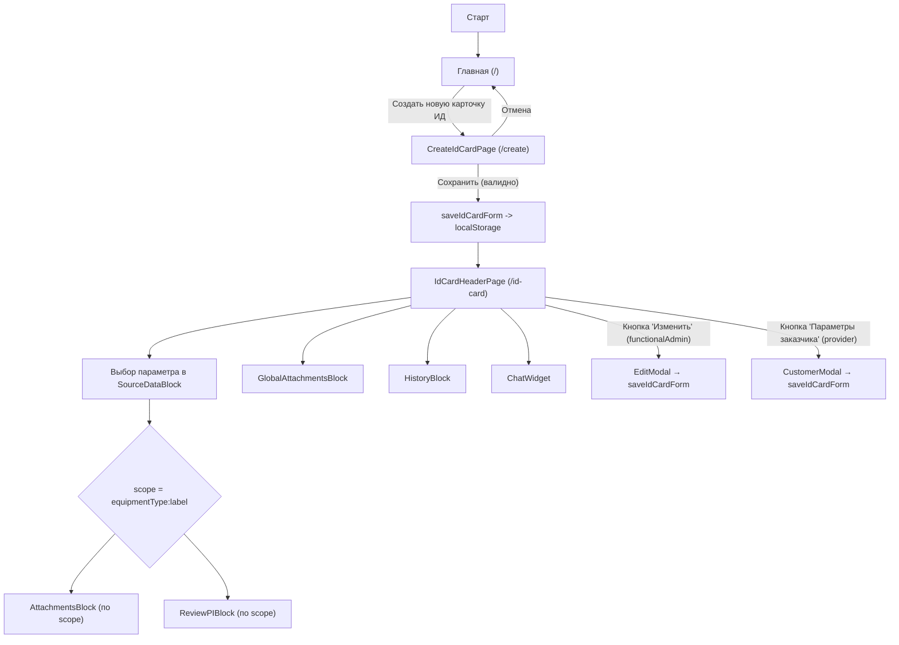
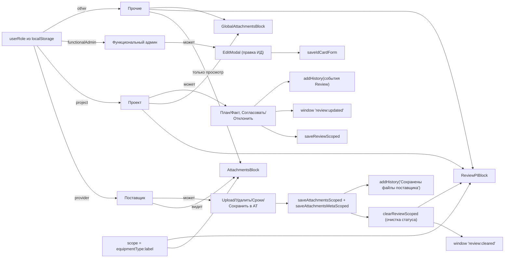

# Документация МВП интерфейса

Ниже описаны пользовательский путь, правила доступности функционала по ролям и зависимостям, а также диаграммы взаимодействия.

## Пользовательский путь и переходы

## Роли, права и зависимости

## Правила видимости и доступности по ролям

- **functionalAdmin**:
  - Доступна кнопка «Изменить» в шапке ИД (правка всех полей карточки, сохранение в `idCardForm`).
- **provider**:
  - Доступна кнопка «Заполнить параметры заказчика» в шапке ИД.
  - В `AttachmentsBlock` доступны: загрузка/удаление файлов, редактирование сроков (дни/план/факт), «Сохранить».
  - Сохранение в `AttachmentsBlock` обнуляет Review для текущего `scope` и пишет историю.
- **project**:
  - В `ReviewPIBlock` доступны: редактирование план/факт, «Согласовать», «Отклонить» (с причиной). Сохраняет и пишет историю.
  - В `GlobalAttachmentsBlock` доступны: загрузка/удаление, «Сохранить».
- **other**:
  - Только просмотр всех блоков; загрузка/правка недоступны.

## Зависимости блоков от данных и выбора

- **scope**: вычисляется как `equipmentType:labelПараметра` при выборе пункта в `SourceDataBlock`.
  - `AttachmentsBlock` и `ReviewPIBlock` всегда отображают данные по текущему `scope`.
  - Смена параметра → перечитка данных для нового `scope` в этих блоках.
- **equipmentType**: влияет на состав списка параметров в `SourceDataBlock`.
- **События окна**:
  - `review:cleared` — посылается `AttachmentsBlock` при сохранении; `ReviewPIBlock` очищает статус для текущего `scope`.
  - `review:updated` — посылается `ReviewPIBlock` при действиях; подписчики синхронизируются.
  - `history:updated` — посылается при `addHistory`; `HistoryBlock` перечитывает список.

## Краткое описание страниц и блоков

- **HomePage**: кнопка → `/create`.
- **CreateIdCardPage**: модалка с валидацией; «Сохранить» → `idCardForm` → `/id-card`, «Отмена» → `/`.
- **IdCardHeaderPage**: шапка ИД, выбор параметра → формирует `scope`; содержит `SourceDataBlock`, `AttachmentsBlock`, `ReviewPIBlock`, `GlobalAttachmentsBlock`, `HistoryBlock`, `ChatWidget`. Кнопки зависят от роли.
- **SourceDataBlock**: список параметров по `equipmentType`; влияет на `scope`.
- **AttachmentsBlock**: работа с файлами поставщика и сроками по `scope`; «Сохранить» записывает данные и сбрасывает Review.
- **ReviewPIBlock**: план/факт и статус согласования по `scope` (проект); пишет историю.
- **GlobalAttachmentsBlock**: файлы проекта (без `scope`) — управление доступно проекту.
- **HistoryBlock**: вывод истории действий.
- **ChatWidget**: локальный чат без сохранения в хранилище.

## Маппинг компонентов блоков: названия и функционал

- **Исходные данные** (`SourceDataBlock`): отображает список параметров по текущему `equipmentType`; выбор пункта формирует `scope = equipmentType:label` для зависимых блоков.
- **Файлы от поставщика** (`AttachmentsBlock`): работа с файлами и сроками по текущему `scope`. Роль `provider` может загружать/удалять файлы, редактировать сроки (дни/план/факт) и сохранять; сохранение сбрасывает Review для этого `scope` и пишет запись в историю. Остальные роли — просмотр/скачивание.
- **Рассмотрение ПИ** (`ReviewPIBlock`): управление статусом параметра по текущему `scope`. Роль `project` задаёт план/факт даты, «Согласовать/Отклонить» (с причиной), сохраняет и пишет историю; остальные роли — только просмотр. Реагирует на `review:cleared` и эмитит `review:updated`.
- **Файлы проекта** (`GlobalAttachmentsBlock`): общий пул файлов проекта (не зависит от `scope`). Роль `project` может загружать/удалять/сохранять; остальные роли — просмотр/скачивание.
- **История изменений** (`HistoryBlock`): выводит события из `historyLog`, подписан на `history:updated` для автообновления.
- **Чат** (`ChatWidget`): локальный виджет чата без сохранения в хранилище; не влияет на бизнес-логику.
